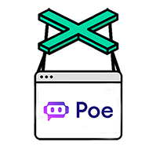
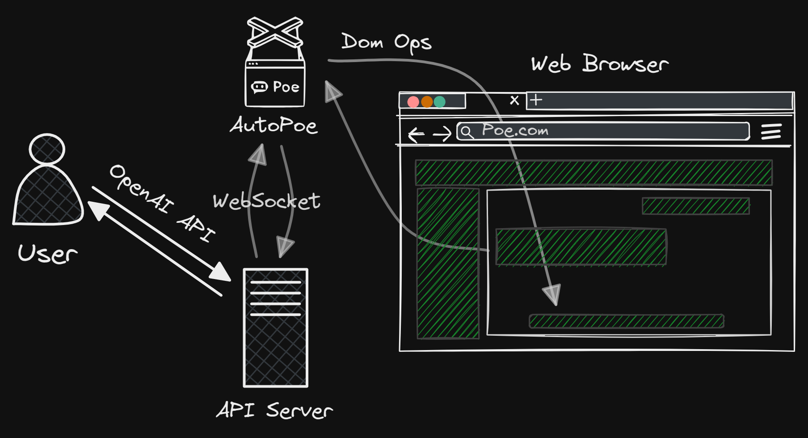

<div align="center">


# *AutoPoe*

**AutoPoe** is a web automation tool designed to seamlessly interact with bots on [Poe](https://poe.com) by leveraging the OpenAI API.

[]()
[]()
[]()

</div>

## 🚀 News

- [2024.02.23] First release.

## ⚙️ How it works

<p align="center">
    
</p>

## 🔧 How to deploy

1. 📦 Install Dependencies

    ```bash
    pip install -r requirements.txt
    ```

2. 🚀 Run Server

    ```bash
    python openai_api.py
    ```

3. 📁 Load Extension

    1. Open [chrome://extensions](chrome://extensions).
    2. Enable developer mode (top right of page).
    3. Click "Load unpacked extension" (top left page).
    4. Select [extension](/build) directory.

4. 🌐 Open Poe

    1. Open [Poe.com](https://poe.com).
    2. Login to your account.
    3. Open Chat Page.

- ⚠️ **Note**

    Due to this [reason](https://developer.chrome.com/docs/extensions/how-to/web-platform/websockets#background), please strictly follow the above steps to ensure the websocket connection is established.

## 🪛 How to use

See [**openai_api_request.py**](/openai_api_request.py) for more details.

## 👋 Contribution

Welcome to contribute by creating [**issues**](./issues) or submitting [**pull requests**](./pulls).